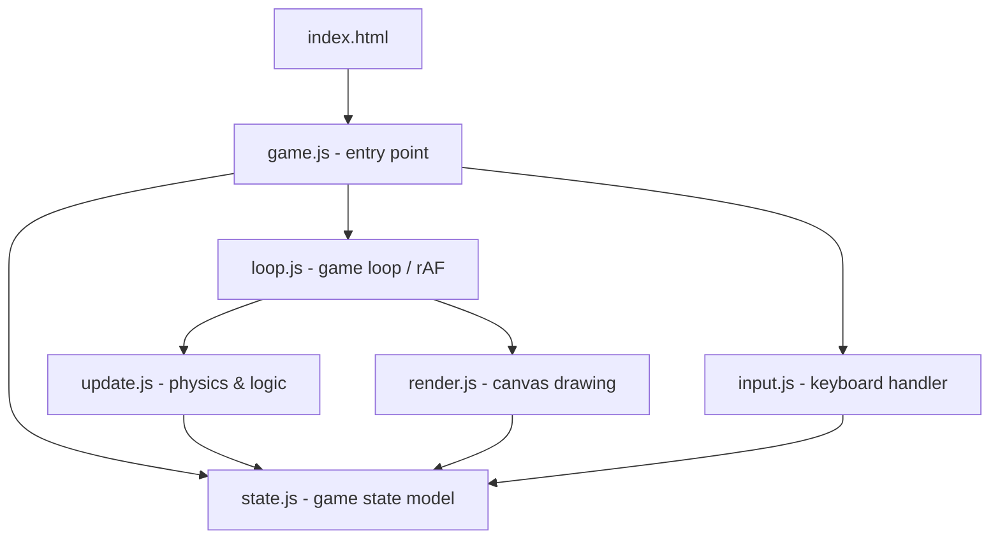

# Design Document: Mango The Dove

## Overview

A browser-based Mango The Dove game implemented in vanilla JavaScript using the HTML5 Canvas API. The game runs entirely client-side with no backend dependencies. The player controls a bird that continuously moves forward; gravity pulls it down, and pressing space applies an upward impulse. The goal is to pass through as many pipe gaps as possible without dying.

The implementation follows a simple game loop pattern: update state each tick, then render the updated state to the canvas. Game state is modeled as a plain JavaScript object, making it easy to reset and reason about.

**Technology choices:**
- HTML5 Canvas for rendering (no external libraries)
- `requestAnimationFrame` for the game loop
- Vanilla JS (ES6 modules) for logic
- No build tooling required — runs directly in the browser

---

## Architecture

The game is structured around three concerns: **state**, **update**, and **render**.



**File responsibilities:**

- `index.html` — canvas element, loads `game.js`
- `game.js` — initializes state, wires input, starts loop
- `state.js` — defines initial state shape and reset function
- `loop.js` — `requestAnimationFrame` loop, calls update then render each frame
- `update.js` — physics (gravity, velocity, position), pipe spawning/movement, collision detection, scoring, high score tracking, state transitions
- `render.js` — draws everything to the canvas each frame
- `input.js` — listens for spacebar, dispatches flap or state-transition actions

---

## Components and Interfaces

### State Machine

The game has three states:

```
START → PLAYING → GAME_OVER → START
```

- `START`: Show start screen, wait for spacebar
- `PLAYING`: Run game loop (physics, pipes, scoring)
- `GAME_OVER`: Show game-over screen with final score, wait for restart

### Bird

Represents the player-controlled character.

```js
// Controlled via update logic; not a class, just a sub-object of state
bird: {
  x: Number,        // fixed horizontal position
  y: Number,        // vertical position (pixels from top)
  vy: Number,       // vertical velocity (positive = downward)
  rotation: Number  // visual rotation in radians
}
```

Key behaviors:
- `x` is fixed; the world scrolls left
- Each tick: `vy += GRAVITY`, `y += vy`
- On flap: `vy = -FLAP_IMPULSE`
- `rotation` is derived from `vy` (clamped between -30° and +90°)

### Pipes

An array of pipe pair objects:

```js
pipes: [
  {
    x: Number,      // left edge of pipe pair
    gapY: Number,   // top of the gap (pixels from top)
    scored: Boolean // whether the bird has already passed this pipe
  }
]
```

Key behaviors:
- Spawned at `PIPE_SPAWN_INTERVAL` ms (or pixel distance)
- `gapY` randomized within `[GAP_MIN_Y, CANVAS_HEIGHT - GROUND_HEIGHT - GAP_SIZE - GAP_MIN_Y]`
- Each tick: `x -= PIPE_SPEED`
- Removed when `x + PIPE_WIDTH < 0`

### Score

```js
score: Number      // incremented each time bird passes a pipe pair
highScore: Number  // session best; updated when score exceeds it; never reset on restart
```

The `highScore` is initialized to `0` when the game first loads (in `game.js`, not in `createInitialState`). On every restart, before resetting per-round state, the caller does:
```js
state.highScore = Math.max(state.highScore, state.score);
```
Then `createInitialState()` resets everything else but `highScore` is written back.

The high score is rendered persistently on the right side of the canvas at all times (all phases), using `ctx.textAlign = 'right'` near the top-right corner. The current score is rendered centered at the top only during the `PLAYING` phase.

### Game Constants

```js
const CANVAS_WIDTH = 480;
const CANVAS_HEIGHT = 640;
const GROUND_HEIGHT = 80;
const BIRD_X = 100;           // fixed horizontal position
const BIRD_SIZE = 30;         // collision radius / sprite size
const GRAVITY = 0.5;          // px/tick² downward acceleration
const FLAP_IMPULSE = 9;       // upward velocity on spacebar
const PIPE_WIDTH = 60;
const PIPE_SPEED = 3;         // px/tick leftward
const GAP_SIZE = 150;         // vertical gap between top and bottom pipe
const PIPE_SPAWN_X = 600;     // x position where new pipes spawn
const PIPE_INTERVAL = 1800;   // ms between pipe spawns
const GAP_MIN_Y = 80;         // minimum gap top from ceiling
```

---

## Data Models

### GameState

The single source of truth for the entire game:

```js
{
  phase: 'START' | 'PLAYING' | 'GAME_OVER',
  bird: {
    x: Number,
    y: Number,
    vy: Number,
    rotation: Number
  },
  pipes: Array<{
    x: Number,
    gapY: Number,
    scored: Boolean
  }>,
  score: Number,
  highScore: Number,    // best score across all rounds in the session; never reset
  lastPipeTime: Number  // timestamp of last pipe spawn (ms)
}
```

### Initial State (reset)

```js
function createInitialState() {
  return {
    phase: 'START',
    bird: { x: BIRD_X, y: CANVAS_HEIGHT / 2, vy: 0, rotation: 0 },
    pipes: [],
    score: 0,
    lastPipeTime: 0
    // NOTE: highScore is NOT included here — it lives outside per-round state.
    // On restart, the caller (flap/restart logic) preserves the existing highScore
    // by carrying it over: state.highScore = Math.max(state.highScore, state.score)
    // before calling Object.assign(state, createInitialState()).
  };
}
```

### State Transitions

| From       | Event              | To         | Side Effects                        |
|------------|--------------------|------------|-------------------------------------|
| START      | spacebar           | PLAYING    | reset state, start loop             |
| PLAYING    | bird hits ground   | GAME_OVER  | freeze physics                      |
| PLAYING    | bird hits pipe     | GAME_OVER  | freeze physics                      |
| GAME_OVER  | spacebar / restart | START      | update highScore, call createInitialState() |

---


## Correctness Properties

*A property is a characteristic or behavior that should hold true across all valid executions of a system — essentially, a formal statement about what the system should do. Properties serve as the bridge between human-readable specifications and machine-verifiable correctness guarantees.*

### Property 1: Bird horizontal position is invariant

*For any* game state in the PLAYING phase, after any number of update ticks, `bird.x` should remain equal to `BIRD_X`.

**Validates: Requirements 1.1**

---

### Property 2: Physics tick correctly updates velocity and position

*For any* bird state with velocity `vy` and position `y`, after one update tick, the new velocity should be `vy + GRAVITY` and the new position should be `y + (vy + GRAVITY)`.

**Validates: Requirements 1.2, 1.4**

---

### Property 3: Flap sets velocity to upward impulse

*For any* bird state with any vertical velocity, after a flap action is applied, `bird.vy` should equal `-FLAP_IMPULSE` regardless of the prior velocity.

**Validates: Requirements 1.3**

---

### Property 4: Any collision transitions to GAME_OVER

*For any* PLAYING game state where the bird's bounding box overlaps a pipe or the bird's y position reaches the ground, after one update tick the game phase should be `GAME_OVER`.

**Validates: Requirements 2.1, 2.2**

---

### Property 5: Bird is clamped at ceiling

*For any* game state where physics would move `bird.y` below 0, after the update tick `bird.y` should be clamped to 0 (never negative).

**Validates: Requirements 2.3**

---

### Property 6: Pipes spawn after interval elapses

*For any* PLAYING game state where `currentTime - lastPipeTime >= PIPE_INTERVAL`, after an update tick the pipes array should contain one more pipe than before.

**Validates: Requirements 3.1**

---

### Property 7: All pipe gaps are within the playable vertical range

*For any* pipe in the pipes array, `gapY` should satisfy `GAP_MIN_Y <= gapY <= CANVAS_HEIGHT - GROUND_HEIGHT - GAP_SIZE - GAP_MIN_Y`.

**Validates: Requirements 3.2**

---

### Property 8: Pipes move left by PIPE_SPEED each tick

*For any* pipe in the pipes array with position `x`, after one update tick its position should be `x - PIPE_SPEED`.

**Validates: Requirements 3.3**

---

### Property 9: Off-screen pipes are removed

*For any* game state after an update tick, no pipe in the pipes array should have `x + PIPE_WIDTH < 0`.

**Validates: Requirements 3.4**

---

### Property 10: Score increments exactly once per pipe passed

*For any* PLAYING game state where the bird's x crosses a pipe's x for the first time (pipe not yet scored), after the update tick the score should be exactly one greater than before, and the pipe should be marked as scored.

**Validates: Requirements 4.1**

---

### Property 11: Initial state has phase START

*For any* call to `createInitialState()`, the returned state should have `phase === 'START'`, `score === 0`, `pipes === []`, and `bird.y === CANVAS_HEIGHT / 2`.

**Validates: Requirements 5.1**

---

### Property 12: Spacebar in START phase transitions to PLAYING

*For any* game state with `phase === 'START'`, applying the spacebar input action should produce a state with `phase === 'PLAYING'`.

**Validates: Requirements 5.2**

---

### Property 13: Restart produces clean initial state

*For any* game state with `phase === 'GAME_OVER'`, applying the restart action should produce a state equivalent to `createInitialState()` (with `phase === 'START'`, score reset, pipes cleared).

**Validates: Requirements 5.4**

---

### Property 14: Bird rotation reflects vertical velocity

*For any* bird state, after a flap (negative vy) the rotation should be negative (nose up), and after falling for several ticks (positive vy) the rotation should be positive (nose down), clamped within [-30°, +90°].

**Validates: Requirements 6.3, 6.4**

---

### Property 15: High score is monotonically non-decreasing

*For any* sequence of rounds in a session, the `highScore` value after each round should be greater than or equal to the `highScore` before that round. Specifically, after a round ends with `score = S`, `highScore` should equal `max(previousHighScore, S)` — it never decreases and is never reset by `createInitialState()`.

**Validates: Requirements 4.4, 4.5**

---

### Property 16: High score is always >= current score

*For any* game state at any point during a session, `highScore >= score` must hold. Since `highScore` is updated whenever `score` exceeds it, the current score can never exceed the recorded high score.

**Validates: Requirements 4.5**

---

## Error Handling

Since this is a client-side browser game with no network or persistence, error surface is minimal:

- **Canvas not supported**: If `canvas.getContext('2d')` returns null, display a fallback message in the HTML.
- **Invalid pipe gap generation**: The random gap position calculation must be guarded so `gapY` never produces a gap that is fully above the ceiling or below the ground. The formula `GAP_MIN_Y + Math.random() * (CANVAS_HEIGHT - GROUND_HEIGHT - GAP_SIZE - 2 * GAP_MIN_Y)` ensures this.
- **Negative pipe interval**: If `PIPE_INTERVAL` is misconfigured to 0 or negative, pipe spawning would flood the array. A guard `if (PIPE_INTERVAL <= 0) throw new Error(...)` in the constants file prevents this.
- **rAF cancellation**: The game loop handle from `requestAnimationFrame` should be stored so it can be cancelled on game reset, preventing multiple concurrent loops.

---

## Testing Strategy

### Dual Testing Approach

Both unit tests and property-based tests are required. They are complementary:

- **Unit tests** cover specific examples, integration points, and edge cases
- **Property tests** verify universal correctness across randomized inputs

### Property-Based Testing

**Library**: [fast-check](https://github.com/dubzzz/fast-check) (JavaScript, no build required with ESM import)

Each property test must run a minimum of **100 iterations**.

Each test must include a comment tag in the format:
`// Feature: mango-the-dove-game, Property N: <property text>`

| Property | Test Description | fast-check Arbitraries |
|----------|-----------------|------------------------|
| P1 | Bird x never changes after N ticks | `fc.integer({min:1,max:100})` for tick count |
| P2 | Physics tick: vy and y update correctly | `fc.float()` for vy, `fc.float()` for y |
| P3 | Flap sets vy to -FLAP_IMPULSE | `fc.float()` for any prior vy |
| P4 | Collision → GAME_OVER | `fc.record(...)` for bird/pipe positions |
| P5 | Bird y clamped at ceiling | `fc.float({max: -1})` for would-be y |
| P6 | Pipe spawns after interval | `fc.integer(...)` for elapsed time |
| P7 | Pipe gapY in valid range | `fc.integer(...)` for random seed |
| P8 | Pipe moves left by PIPE_SPEED | `fc.float()` for pipe x |
| P9 | No off-screen pipes remain | `fc.array(...)` of pipe states |
| P10 | Score increments once per pipe | `fc.record(...)` for bird/pipe crossing state |
| P11 | Initial state invariants | (example test, no arbitraries needed) |
| P12 | START + spacebar → PLAYING | (example test) |
| P13 | GAME_OVER + restart → clean state | `fc.record(...)` for any GAME_OVER state |
| P14 | Rotation reflects velocity | `fc.float()` for vy values |
| P15 | High score is monotonically non-decreasing across rounds | `fc.array(fc.integer({min:0,max:200}))` for sequence of round scores |
| P16 | High score >= current score at all times | `fc.record(...)` for game state with score and highScore |

### Unit Tests

Focus on:
- Specific collision scenarios (bird exactly at ground boundary, bird exactly overlapping pipe edge)
- Score does not double-increment for the same pipe
- Pipe removal at exactly `x + PIPE_WIDTH === 0` vs `x + PIPE_WIDTH === -1`
- State machine: invalid transitions are ignored (e.g., spacebar during GAME_OVER before restart)
- `createInitialState()` returns a deep copy (mutations don't affect the template)
- `highScore` is preserved across restarts (not overwritten by `createInitialState()`)

### Test File Structure

```
tests/
  unit/
    physics.test.js       // P1, P2, P3, P5, P14
    pipes.test.js         // P6, P7, P8, P9
    collision.test.js     // P4
    scoring.test.js       // P10
    state.test.js         // P11, P12, P13, P15, P16
```

Use any standard JS test runner (e.g., Vitest or Jest) with fast-check installed:

```bash
npm install --save-dev vitest fast-check
npx vitest --run
```
