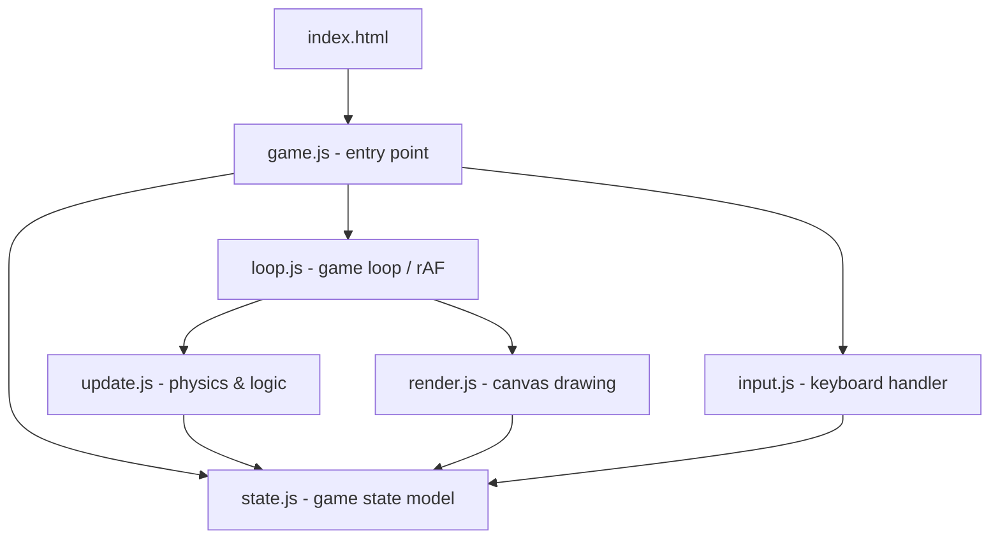

# Design Document: Mango The Dove

## Overview

A browser-based Mango The Dove game implemented in vanilla JavaScript using the HTML5 Canvas API. The game runs entirely client-side with no backend dependencies. The player controls a bird that continuously moves forward; gravity pulls it down, and pressing space applies an upward impulse. The goal is to pass through as many pipe gaps as possible without dying.

The implementation follows a simple game loop pattern: update state each tick, then render the updated state to the canvas. Game state is modeled as a plain JavaScript object, making it easy to reset and reason about.

The game also features a **Burger power-up mechanic**: when the bird passes a pipe, there is a chance (based on `BURGER_ROLL_TARGET`) a burger collectible spawns on the next pipe. Collecting a burger inflates the bird to 1.5× its base size for 5 seconds, making navigation harder but adding excitement. While the bird is inflated, the burger roll is skipped entirely — no new burgers can appear. Collecting another burger while already enlarged has no effect; the burger remains in play.

**Technology choices:**
- HTML5 Canvas for rendering (no external libraries)
- `requestAnimationFrame` for the game loop
- Vanilla JS (ES6 modules) for logic
- No build tooling required — runs directly in the browser

---

## Architecture

The game is structured around three concerns: **state**, **update**, and **render**.



**File responsibilities:**

- `index.html` — canvas element, loads `game.js`
- `game.js` — initializes state, wires input, starts loop
- `state.js` — defines initial state shape and reset function
- `loop.js` — `requestAnimationFrame` loop, calls update then render each frame
- `update.js` — physics (gravity, velocity, position), pipe spawning/movement, collision detection, scoring, high score tracking, burger roll/spawn/collection, enlarge timer countdown, state transitions
- `render.js` — draws everything to the canvas each frame, including burger sprites, enlarged bird, and enlarge timer HUD
- `input.js` — listens for spacebar and touchstart events, dispatches flap or state-transition actions

---

## Components and Interfaces

### State Machine

The game has three states:

```
START → PLAYING → GAME_OVER → START
```

- `START`: Show start screen, wait for spacebar
- `PLAYING`: Run game loop (physics, pipes, scoring, burger logic)
- `GAME_OVER`: Show game-over screen with final score, wait for restart

### Bird

Represents the player-controlled character.

```js
// Controlled via update logic; not a class, just a sub-object of state
bird: {
  x: Number,            // fixed horizontal position
  y: Number,            // vertical position (pixels from top)
  vy: Number,           // vertical velocity (positive = downward)
  rotation: Number,     // visual rotation in radians
  enlarged: Boolean,    // true while in Enlarged_State
  currentSize: Number,  // active collision/render size (BIRD_SIZE when normal, BIRD_SIZE*1.5 when enlarged)
  enlargeTimer: Number  // seconds remaining in Enlarged_State (0 when not enlarged)
}
```

Key behaviors:
- `x` is fixed; the world scrolls left
- Each tick: `vy += GRAVITY * dt`, `y += vy * dt` (semi-implicit Euler, time-based)
- On flap: `vy = -FLAP_IMPULSE`
- `rotation` is derived from `vy` (clamped between -30° and +90°)
- `currentSize` is used for all collision detection and rendering (replaces the constant `BIRD_SIZE` in those calculations)
- `enlargeTimer` counts down each tick by `deltaTime` (seconds); when it reaches 0, `enlarged` is set to false and `currentSize` resets to `BIRD_SIZE`
- While enlarged, collecting another burger has no effect — the burger remains in play and the bird's size/timer are unchanged

### Pipes

An array of pipe pair objects:

```js
pipes: [
  {
    x: Number,      // left edge of pipe pair
    gapY: Number,   // top of the gap (pixels from top)
    scored: Boolean, // whether the bird has already passed this pipe
    burger: null | {
      x: Number,    // left edge of burger sprite
      y: Number,    // top edge of burger sprite
      collected: Boolean  // true once the bird has collected it
    }
  }
]
```

Key behaviors:
- Spawned at `PIPE_SPAWN_INTERVAL` ms (or pixel distance)
- `gapY` randomized within `[GAP_MIN_Y, CANVAS_HEIGHT - GROUND_HEIGHT - GAP_SIZE - GAP_MIN_Y]`
- Each tick: `x -= PIPE_SPEED * dt`
- Removed when `x + PIPE_WIDTH < 0`
- `burger` is `null` unless the pipe was selected for a burger spawn (see Burger Spawning below)
- At most one burger per pipe pair at any time

### Burger Spawning Logic

When the bird passes a pipe (score increments), `update.js` performs a **Burger_Roll**:

```js
const roll = Math.floor(Math.random() * 6) + 1; // uniform integer in [1, 6]
if (BURGER_ROLL_TARGET.includes(roll)) {
  state.pendingBurger = true;
}
```

`state.pendingBurger` is a flag that causes the **next** pipe to spawn with a burger attached:

```js
// Inside pipe spawn logic:
if (state.pendingBurger) {
  const burgerX = pipe.x + PIPE_WIDTH / 2 - BURGER_SIZE / 2;  // horizontally centered
  const gapMid = pipe.gapY + GAP_SIZE / 2;
  const burgerY = gapMid + Math.random() * (GAP_SIZE / 2 - BURGER_SIZE); // bottom half of gap
  pipe.burger = { x: burgerX, y: burgerY, collected: false };
  state.pendingBurger = false;
}
```

### Burger Collection

Each tick, `update.js` checks for overlap between the bird's bounding box and each pipe's burger:

```js
for (const pipe of state.pipes) {
  if (pipe.burger && !pipe.burger.collected) {
    const birdRight = bird.x + bird.currentSize;
    const birdBottom = bird.y + bird.currentSize;
    const burgerRight = pipe.burger.x + BURGER_SIZE;
    const burgerBottom = pipe.burger.y + BURGER_SIZE;
    const overlaps =
      bird.x < burgerRight &&
      birdRight > pipe.burger.x &&
      bird.y < burgerBottom &&
      birdBottom > pipe.burger.y;
    if (overlaps) {
      if (bird.enlarged) {
        // While enlarged, burgers have no effect — burger stays in play
        continue;
      }
      pipe.burger.collected = true;  // remove from play
      bird.enlarged = true;
      bird.currentSize = BIRD_SIZE * 1.5;
      bird.enlargeTimer = ENLARGE_DURATION;  // start 5s timer
    }
  }
}
```

### Enlarge Timer Countdown

Each tick while `bird.enlarged === true`, the timer counts down:

```js
if (bird.enlarged) {
  bird.enlargeTimer -= deltaTime;  // deltaTime in seconds
  if (bird.enlargeTimer <= 0) {
    bird.enlarged = false;
    bird.currentSize = BIRD_SIZE;  // always restore to base size
    bird.enlargeTimer = 0;
  }
}
```

### Score

```js
score: Number      // incremented each time bird passes a pipe pair (+1 normal, +2 while enlarged)
highScore: Number  // session best; updated when score exceeds it; never reset on restart
```

Scoring awards **2 points** per pipe passed while the bird is in the Enlarged_State, and **1 point** otherwise. This makes the burger power-up a risk/reward trade-off: the bird is harder to navigate at 1.5× size, but scores double.

The `highScore` is initialized to `0` when the game first loads (in `game.js`, not in `createInitialState`). On every restart, before resetting per-round state, the caller does:
```js
state.highScore = Math.max(state.highScore, state.score);
```
Then `createInitialState()` resets everything else but `highScore` is written back.

The high score is rendered persistently on the right side of the canvas at all times (all phases), using `ctx.textAlign = 'right'` near the top-right corner. The current score is rendered centered at the top only during the `PLAYING` phase.

### Game Constants

All physics constants are expressed in **per-second** units. The `update()` function multiplies them by `deltaTime` (seconds since last frame) each tick, making the game run at the same speed regardless of monitor refresh rate (60Hz, 120Hz, 144Hz, etc.). A `deltaTime` cap of 0.05s prevents physics explosions on tab-switch or debugger pause.

```js
const CANVAS_WIDTH = 480;
const CANVAS_HEIGHT = 640;
const GROUND_HEIGHT = 80;
const BIRD_X = 100;              // fixed horizontal position
const BIRD_SIZE = 30;            // base collision radius / sprite size
const GRAVITY = 1800;            // px/s² downward acceleration
const FLAP_IMPULSE = 540;        // px/s upward velocity on spacebar
const PIPE_WIDTH = 60;
const PIPE_SPEED = 180;          // px/s leftward
const GAP_SIZE = 150;            // vertical gap between top and bottom pipe
const PIPE_SPAWN_X = 600;        // x position where new pipes spawn
const PIPE_INTERVAL = 1800;      // ms between pipe spawns
const GAP_MIN_Y = 80;            // minimum gap top from ceiling
const BURGER_SIZE = 30;          // width and height of burger sprite/hitbox
const BURGER_ROLL_TARGET = [2];  // array of roll values that trigger a burger spawn (tunable)
const ENLARGE_DURATION = 5;      // seconds the Enlarged_State lasts
```

---

## Data Models

### GameState

The single source of truth for the entire game:

```js
{
  phase: 'START' | 'PLAYING' | 'GAME_OVER',
  bird: {
    x: Number,
    y: Number,
    vy: Number,
    rotation: Number,
    enlarged: Boolean,    // true while in Enlarged_State
    currentSize: Number,  // active size for collision and rendering
    enlargeTimer: Number  // seconds remaining; 0 when not enlarged
  },
  pipes: Array<{
    x: Number,
    gapY: Number,
    scored: Boolean,
    burger: null | {
      x: Number,          // left edge of burger sprite
      y: Number,          // top edge of burger sprite
      collected: Boolean  // removed from play once true
    }
  }>,
  score: Number,
  highScore: Number,      // best score across all rounds in the session; never reset
  lastPipeTime: Number,   // timestamp of last pipe spawn (ms)
  pendingBurger: Boolean, // true when next pipe spawn should include a burger
  lastRoll: Number | null // most recent burger roll result; null before first roll (used by debug overlay)
}
```

### Initial State (reset)

```js
function createInitialState() {
  return {
    phase: 'START',
    bird: {
      x: BIRD_X,
      y: CANVAS_HEIGHT / 2,
      vy: 0,
      rotation: 0,
      enlarged: false,
      currentSize: BIRD_SIZE,
      enlargeTimer: 0
    },
    pipes: [],
    score: 0,
    lastPipeTime: 0,
    pendingBurger: false,
    lastRoll: null
    // NOTE: highScore is NOT included here — it lives outside per-round state.
    // On restart, the caller (flap/restart logic) preserves the existing highScore
    // by carrying it over: state.highScore = Math.max(state.highScore, state.score)
    // before calling Object.assign(state, createInitialState()).
  };
}
```

### State Transitions

| From       | Event                        | To         | Side Effects                        |
|------------|------------------------------|------------|-------------------------------------|
| START      | spacebar / tap               | PLAYING    | reset state, start loop             |
| PLAYING    | bird hits ground             | GAME_OVER  | freeze physics                      |
| PLAYING    | bird hits pipe               | GAME_OVER  | freeze physics                      |
| GAME_OVER  | spacebar / tap / restart     | START      | update highScore, call createInitialState() |

### Input Handling

`initInput(onSpacebar)` registers two event listeners on `window`:

1. **`keydown`** — fires `onSpacebar()` when `event.key === ' '`
2. **`touchstart`** — fires `onSpacebar()` on any touch, and calls `event.preventDefault()` to suppress browser scroll/zoom behavior on mobile (iOS Safari, Android Chrome)

Both listeners invoke the same `onSpacebar` callback, so touch input is fully equivalent to spacebar across all game phases (START, PLAYING, GAME_OVER).

---

## Correctness Properties

*A property is a characteristic or behavior that should hold true across all valid executions of a system — essentially, a formal statement about what the system should do. Properties serve as the bridge between human-readable specifications and machine-verifiable correctness guarantees.*

### Property 1: Bird horizontal position is invariant

*For any* game state in the PLAYING phase, after any number of update ticks, `bird.x` should remain equal to `BIRD_X`.

**Validates: Requirements 1.1**

---

### Property 2: Physics tick correctly updates velocity and position

*For any* bird state with velocity `vy` and position `y`, after one update tick with deltaTime `dt`, the new velocity should be `vy + GRAVITY * dt` and the new position should be `y + (vy + GRAVITY * dt) * dt`.

**Validates: Requirements 1.2, 1.4**

---

### Property 3: Flap sets velocity to upward impulse

*For any* bird state with any vertical velocity, after a flap action is applied, `bird.vy` should equal `-FLAP_IMPULSE` regardless of the prior velocity.

**Validates: Requirements 1.3**

---

### Property 4: Any collision transitions to GAME_OVER

*For any* PLAYING game state where the bird's bounding box overlaps a pipe or the bird's y position reaches the ground, after one update tick the game phase should be `GAME_OVER`.

**Validates: Requirements 2.1, 2.2**

---

### Property 5: Bird is clamped at ceiling

*For any* game state where physics would move `bird.y` below 0, after the update tick `bird.y` should be clamped to 0 (never negative).

**Validates: Requirements 2.3**

---

### Property 6: Pipes spawn after interval elapses

*For any* PLAYING game state where `currentTime - lastPipeTime >= PIPE_INTERVAL`, after an update tick the pipes array should contain one more pipe than before.

**Validates: Requirements 3.1**

---

### Property 7: All pipe gaps are within the playable vertical range

*For any* pipe in the pipes array, `gapY` should satisfy `GAP_MIN_Y <= gapY <= CANVAS_HEIGHT - GROUND_HEIGHT - GAP_SIZE - GAP_MIN_Y`.

**Validates: Requirements 3.2**

---

### Property 8: Pipes move left by PIPE_SPEED * dt each tick

*For any* pipe in the pipes array with position `x`, after one update tick with deltaTime `dt`, its position should be `x - PIPE_SPEED * dt`.

**Validates: Requirements 3.3**

---

### Property 9: Off-screen pipes are removed

*For any* game state after an update tick, no pipe in the pipes array should have `x + PIPE_WIDTH < 0`.

**Validates: Requirements 3.4**

---

### Property 10: Score increments correctly per pipe passed

*For any* PLAYING game state where the bird's x crosses a pipe's x for the first time (pipe not yet scored), after the update tick the score should increase by 1 if the bird is not enlarged, or by 2 if the bird is in the Enlarged_State, and the pipe should be marked as scored.

**Validates: Requirements 4.1, 4.2**

---

### Property 11: Initial state has phase START

*For any* call to `createInitialState()`, the returned state should have `phase === 'START'`, `score === 0`, `pipes === []`, `bird.y === CANVAS_HEIGHT / 2`, `bird.enlarged === false`, `bird.currentSize === BIRD_SIZE`, `bird.enlargeTimer === 0`, and `pendingBurger === false`.

**Validates: Requirements 5.1**

---

### Property 12: Spacebar in START phase transitions to PLAYING

*For any* game state with `phase === 'START'`, applying the spacebar input action should produce a state with `phase === 'PLAYING'`.

**Validates: Requirements 5.2**

---

### Property 13: Restart produces clean initial state

*For any* game state with `phase === 'GAME_OVER'`, applying the restart action should produce a state equivalent to `createInitialState()` (with `phase === 'START'`, score reset, pipes cleared, `pendingBurger === false`, bird not enlarged).

**Validates: Requirements 5.4**

---

### Property 14: Bird rotation reflects vertical velocity

*For any* bird state, after a flap (negative vy) the rotation should be negative (nose up), and after falling for several ticks (positive vy) the rotation should be positive (nose down), clamped within [-30°, +90°].

**Validates: Requirements 6.3, 6.4**

---

### Property 15: High score is monotonically non-decreasing

*For any* sequence of rounds in a session, the `highScore` value after each round should be greater than or equal to the `highScore` before that round. Specifically, after a round ends with `score = S`, `highScore` should equal `max(previousHighScore, S)` — it never decreases and is never reset by `createInitialState()`.

**Validates: Requirements 4.4, 4.5**

---

### Property 16: High score is always >= current score

*For any* game state at any point during a session, `highScore >= score` must hold. Since `highScore` is updated whenever `score` exceeds it, the current score can never exceed the recorded high score.

**Validates: Requirements 4.5**

---

### Property 17: Burger roll always produces an integer in [1, 6]

*For any* call to the burger roll function, the result should be an integer `n` satisfying `1 <= n <= 6`. This holds across all invocations regardless of the current game state.

**Validates: Requirements 8.1**

---

### Property 18: Burger spawns on next pipe if and only if pendingBurger is true

*For any* PLAYING game state, when a new pipe spawns: if `state.pendingBurger === true` then the new pipe should have `burger !== null` and `pendingBurger` should be reset to `false`; if `state.pendingBurger === false` then the new pipe should have `burger === null`.

**Validates: Requirements 8.2, 8.4**

---

### Property 19: Burger position is centered on pipe and in the bottom half of the gap

*For any* pipe with a burger attached, the burger's horizontal center should equal the pipe's horizontal center (`burger.x + BURGER_SIZE / 2 === pipe.x + PIPE_WIDTH / 2`), and the burger's top edge should be within the bottom half of the gap (`pipe.gapY + GAP_SIZE / 2 <= burger.y` and `burger.y + BURGER_SIZE <= pipe.gapY + GAP_SIZE`).

**Validates: Requirements 8.3**

---

### Property 20: At most one burger per pipe pair at any time

*For any* game state after any number of update ticks, every pipe in the pipes array should have `burger` as either `null` or a single object — never multiple burgers on the same pipe.

**Validates: Requirements 8.5**

---

### Property 21: Collecting a burger enters Enlarged_State with correct initial values

*For any* PLAYING game state where the bird's bounding box overlaps a burger and the bird is not currently enlarged, after the update tick: the burger should be marked as collected, `bird.enlarged === true`, `bird.currentSize === BIRD_SIZE * 1.5`, and `bird.enlargeTimer === ENLARGE_DURATION`.

**Validates: Requirements 9.1, 9.2**

---

### Property 22: Timer expiry restores bird to base size

*For any* enlarged bird state, after enough ticks for `enlargeTimer` to reach 0: `bird.enlarged === false`, `bird.currentSize === BIRD_SIZE`, and `bird.enlargeTimer === 0`.

**Validates: Requirements 9.3, 9.6**

---

### Property 23: Collecting a burger while enlarged has no effect

*For any* enlarged bird state with `currentSize === S`, when the bird's bounding box overlaps a burger, after the update tick: the burger should NOT be collected (remains in play), `bird.currentSize` should remain `S`, and `bird.enlargeTimer` should be unchanged.

**Validates: Requirements 9.4**

---

### Property 24: Enlarged collision size applies to ground and pipe detection

*For any* enlarged bird state where `bird.y + bird.currentSize >= CANVAS_HEIGHT - GROUND_HEIGHT` (ground collision using enlarged size), after the update tick the game phase should be `GAME_OVER`. Equivalently, a bird position that would be safe at `BIRD_SIZE` but unsafe at `currentSize` should still trigger `GAME_OVER`.

**Validates: Requirements 9.5**

---

### Property 25: Render uses bird.currentSize when drawing the bird

*For any* enlarged bird state with `currentSize === S`, the render function should draw the bird sprite (or fallback rectangle) with width and height equal to `S`, not `BIRD_SIZE`.

**Validates: Requirements 10.2**

---

### Property 26: Render displays Math.ceil(enlargeTimer) when bird is enlarged

*For any* enlarged bird state with `enlargeTimer === T` (where `T > 0`), the render function should display `Math.ceil(T)` as the timer value on screen.

**Validates: Requirements 10.4**

---

### Property 27: BURGER_ROLL_TARGET is an array and roll check uses Array.includes

*For any* Burger_Roll result `r`, `pendingBurger` should be set to `true` if and only if `BURGER_ROLL_TARGET.includes(r)` is `true`. Adding or removing values from the array changes which rolls trigger a burger spawn without any other code changes.

**Validates: Requirements 8.2, 8.4**

---

### Property 28: Debug overlay renders iff DEBUG flag is active and phase is PLAYING

*For any* game state with `phase === 'PLAYING'`, the render function should produce a `fillText` call containing the `BURGER_ROLL_TARGET` array representation when `DEBUG === true`, and should produce no such call when `DEBUG === false`.

**Validates: Requirements 11.2, 11.3, 11.4**

---

### Debug Overlay

The debug overlay is activated when `window.location.search` contains the `debug` parameter (checked once at module load in `game.js`):

```js
const DEBUG = new URLSearchParams(window.location.search).has('debug');
```

`DEBUG` is passed into `render()` (or accessed as a module-level constant imported by `render.js`). When `DEBUG === true` and `state.phase === 'PLAYING'`, `render.js` draws a small overlay in the bottom-right corner:

```js
if (DEBUG && state.phase === 'PLAYING') {
  ctx.fillStyle = 'rgba(0,0,0,0.55)';
  ctx.fillRect(CANVAS_WIDTH - 160, CANVAS_HEIGHT - 60, 155, 52);
  ctx.fillStyle = '#00ff99';
  ctx.font = '13px monospace';
  ctx.textAlign = 'right';
  ctx.fillText(`target: ${JSON.stringify(BURGER_ROLL_TARGET)}`, CANVAS_WIDTH - 8, CANVAS_HEIGHT - 42);
  ctx.fillText(`roll:   ${state.lastRoll ?? '—'}`, CANVAS_WIDTH - 8, CANVAS_HEIGHT - 24);
}
```

`state.lastRoll` is updated in `update.js` each time a Burger_Roll is performed:

```js
const roll = Math.floor(Math.random() * 6) + 1;
state.lastRoll = roll;
if (BURGER_ROLL_TARGET.includes(roll)) { state.pendingBurger = true; }
```

`state.lastRoll` is initialised to `null` in `createInitialState()` and reset to `null` on restart so the overlay shows `—` at the start of each round.

---

## Error Handling

Since this is a client-side browser game with no network or persistence, error surface is minimal:

- **Canvas not supported**: If `canvas.getContext('2d')` returns null, display a fallback message in the HTML.
- **Invalid pipe gap generation**: The random gap position calculation must be guarded so `gapY` never produces a gap that is fully above the ceiling or below the ground. The formula `GAP_MIN_Y + Math.random() * (CANVAS_HEIGHT - GROUND_HEIGHT - GAP_SIZE - 2 * GAP_MIN_Y)` ensures this.
- **Negative pipe interval**: If `PIPE_INTERVAL` is misconfigured to 0 or negative, pipe spawning would flood the array. A guard `if (PIPE_INTERVAL <= 0) throw new Error(...)` in the constants file prevents this.
- **rAF cancellation**: The game loop handle from `requestAnimationFrame` should be stored so it can be cancelled on game reset, preventing multiple concurrent loops.
- **Burger image load failure**: `burgerImage.complete && burgerImage.naturalWidth > 0` is checked before calling `drawImage`. If false, a fallback colored rectangle (e.g., brown/orange) is drawn at the burger's position so it remains visible and collectible. This mirrors the existing pattern used for the bird image.
- **Burger position out of gap bounds**: The burger Y calculation clamps to `[gapMid, gapY + GAP_SIZE - BURGER_SIZE]` to ensure the burger never overlaps the pipe walls. If `GAP_SIZE / 2 < BURGER_SIZE`, the burger is placed at the gap midpoint as a safe fallback.
- **Enlarge timer precision**: `enlargeTimer` is decremented by `deltaTime` (seconds derived from `requestAnimationFrame` timestamps). Floating-point drift is handled by clamping to 0 rather than allowing negative values.

---

## Testing Strategy

### Dual Testing Approach

Both unit tests and property-based tests are required. They are complementary:

- **Unit tests** cover specific examples, integration points, and edge cases
- **Property tests** verify universal correctness across randomized inputs

### Property-Based Testing

**Library**: [fast-check](https://github.com/dubzzz/fast-check) (JavaScript, no build required with ESM import)

Each property test must run a minimum of **100 iterations**.

Each test must include a comment tag in the format:
`// Feature: mango-the-dove-game, Property N: <property text>`

| Property | Test Description | fast-check Arbitraries |
|----------|-----------------|------------------------|
| P1 | Bird x never changes after N ticks | `fc.integer({min:1,max:100})` for tick count |
| P2 | Physics tick: vy and y update correctly | `fc.float()` for vy, `fc.float()` for y |
| P3 | Flap sets vy to -FLAP_IMPULSE | `fc.float()` for any prior vy |
| P4 | Collision → GAME_OVER | `fc.record(...)` for bird/pipe positions |
| P5 | Bird y clamped at ceiling | `fc.float({max: -1})` for would-be y |
| P6 | Pipe spawns after interval | `fc.integer(...)` for elapsed time |
| P7 | Pipe gapY in valid range | `fc.integer(...)` for random seed |
| P8 | Pipe moves left by PIPE_SPEED | `fc.float()` for pipe x |
| P9 | No off-screen pipes remain | `fc.array(...)` of pipe states |
| P10 | Score increments +1 normal, +2 enlarged per pipe | `fc.record(...)` for bird/pipe crossing state, `fc.boolean()` for enlarged |
| P11 | Initial state invariants | (example test, no arbitraries needed) |
| P12 | START + spacebar → PLAYING | (example test) |
| P13 | GAME_OVER + restart → clean state | `fc.record(...)` for any GAME_OVER state |
| P14 | Rotation reflects velocity | `fc.float()` for vy values |
| P15 | High score is monotonically non-decreasing across rounds | `fc.array(fc.integer({min:0,max:200}))` for sequence of round scores |
| P16 | High score >= current score at all times | `fc.record(...)` for game state with score and highScore |
| P17 | Burger roll always in [1, 6] | (example test — call roll function 1000 times, verify range) |
| P18 | Burger spawns iff pendingBurger=true | `fc.boolean()` for pendingBurger, `fc.record(...)` for pipe spawn state |
| P19 | Burger position centered on pipe and in bottom half of gap | `fc.integer(...)` for gapY within valid range |
| P20 | At most one burger per pipe pair | `fc.array(...)` of pipe states after N updates |
| P21 | Collecting burger → Enlarged_State with correct values | `fc.record(...)` for overlapping bird/burger positions |
| P22 | Timer expiry restores size to BIRD_SIZE | `fc.float({min:0.001,max:5})` for initial enlargeTimer |
| P23 | Collecting burger while enlarged has no effect — burger stays, size unchanged | `fc.record(...)` for enlarged bird state overlapping a burger |
| P24 | Enlarged collision applies to ground/pipe detection | `fc.record(...)` for bird positions near boundaries using currentSize |
| P25 | Render uses bird.currentSize when drawing bird | `fc.integer({min:BIRD_SIZE,max:BIRD_SIZE*8})` for currentSize |
| P26 | Render displays Math.ceil(enlargeTimer) when enlarged | `fc.float({min:0.001,max:5})` for enlargeTimer |

### Unit Tests

Focus on:
- Specific collision scenarios (bird exactly at ground boundary, bird exactly overlapping pipe edge)
- Score does not double-increment for the same pipe
- Pipe removal at exactly `x + PIPE_WIDTH === 0` vs `x + PIPE_WIDTH === -1`
- State machine: invalid transitions are ignored (e.g., spacebar during GAME_OVER before restart)
- `createInitialState()` returns a deep copy (mutations don't affect the template)
- `highScore` is preserved across restarts (not overwritten by `createInitialState()`)
- Burger image fallback: when `burgerImage.naturalWidth === 0`, render calls `fillRect` instead of `drawImage`
- Burger not collected when bird does not overlap (adjacent but not touching)
- `pendingBurger` is reset to `false` after the next pipe spawns with a burger
- `enlargeTimer` does not go below 0 (clamped)
- Enlarge timer HUD is not rendered when `bird.enlarged === false`

### Test File Structure

```
tests/
  unit/
    physics.test.js       // P1, P2, P3, P5, P14
    pipes.test.js         // P6, P7, P8, P9, P18, P19, P20
    collision.test.js     // P4, P24
    scoring.test.js       // P10
    state.test.js         // P11, P12, P13, P15, P16
    burger.test.js        // P17, P21, P22, P23 (burger collection and enlarge logic — no stacking)
    render.test.js        // P25, P26 (burger/bird rendering with mock canvas context)
```

Use any standard JS test runner (e.g., Vitest or Jest) with fast-check installed:

```bash
npm install --save-dev vitest fast-check
npx vitest --run
```
