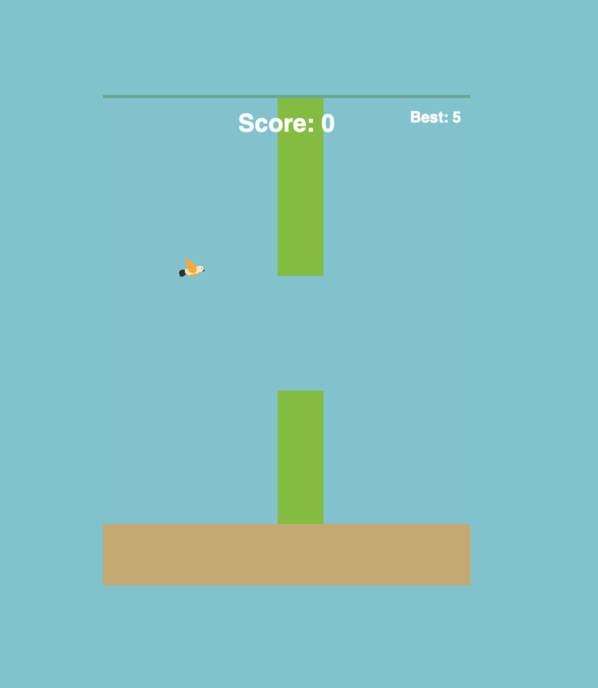

# Mango The Dove

> This project was built using [Kiro](https://kiro.dev), an AI-powered IDE, following a spec-driven development workflow. The full spec (requirements, design, and tasks) lives in `.kiro/specs/`.

## Gameplay



A browser-based game where you guide a dove through pipe gaps. Built with vanilla JavaScript and the HTML5 Canvas API. No build step required.

## Running the Game

Because the game uses ES modules, you need to serve it over HTTP rather than opening `index.html` directly as a `file://` URL.

Any static file server works. A few quick options:

**Node (via npx):**
```bash
npx serve .
```

**Python:**
```bash
python3 -m http.server 8080
```

Then open `http://localhost:8080` (or whatever port is shown) in your browser.

## How to Play

- Press **Space** on the start screen to begin
- Press **Space** to flap — each press gives the bird an upward boost
- Gravity pulls the bird down continuously, so keep tapping to stay airborne
- Fly through the gaps between pipes to score points
- Hitting a pipe, the ground, or letting the bird fall off-screen ends the game
- Press **Space** on the game over screen to restart

## Running Tests

Install dependencies first:
```bash
npm install
```

Then run the test suite:
```bash
npm test
```

Tests use [Vitest](https://vitest.dev/) and [fast-check](https://github.com/dubzzz/fast-check) for property-based testing. All tests run in a single pass with no watch mode.

## Project Structure

```
index.html          # Entry point — canvas element
src/
  constants.js      # All game constants (canvas size, physics, pipe config)
  state.js          # createInitialState() — the game state shape
  update.js         # Physics, pipe logic, collision, scoring, state transitions
  input.js          # Keyboard input (spacebar handler)
  loop.js           # requestAnimationFrame game loop
  render.js         # Canvas drawing (background, pipes, bird, UI screens)
  game.js           # Wires everything together
tests/
  unit/
    physics.test.js
    pipes.test.js
    collision.test.js
    scoring.test.js
    state.test.js
    loop.test.js
```
